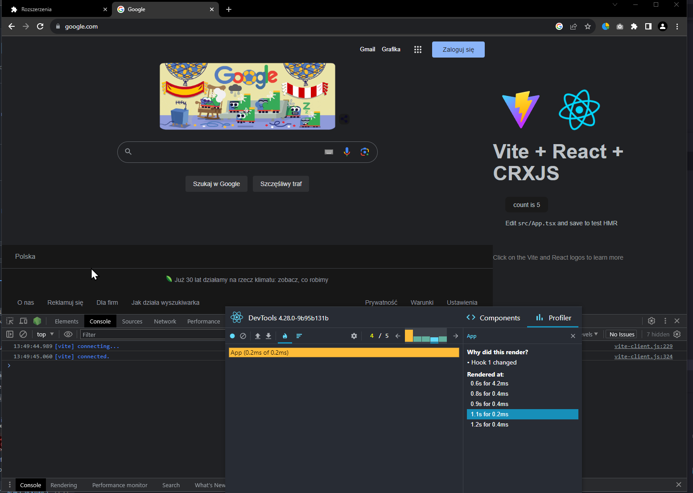
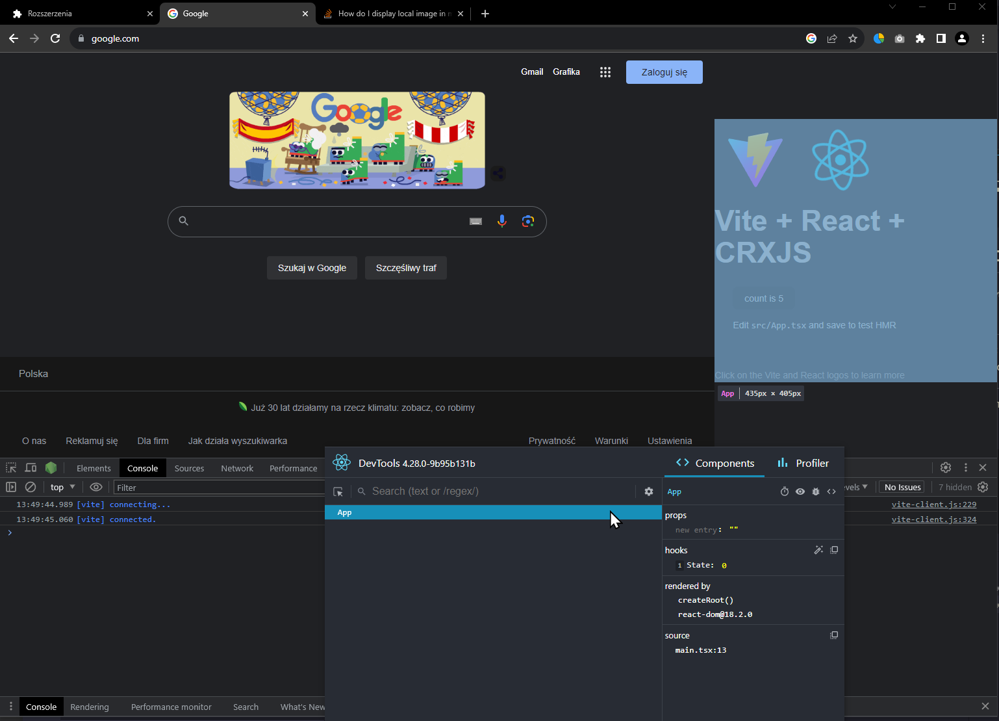

# crxjs-vite-4-react-devtools

This repo shows how to currently run react-devtools for the best IMHO vite react extension toolchain - [crxjs/chrome-extension-tools](https://github.com/crxjs/chrome-extension-tools).

Full explanation: https://github.com/crxjs/chrome-extension-tools/discussions/752#discussioncomment-6770901

To recreate in your repo simply look at the last commit i've made here.

---

**Warning** Running `npm run react-devtools:patch` breaks HMR. To continue developing normally after profiling unpatch it `npm run react-devtools:unpatch`

---

This repo is already prepared so to run the demo

1. Clone, install, patch

```shell
git clone
npm i
npm run react-devtools:patch
npm run dev
```

2. Run the standalone react-devtools

```
npm run react-devtools
```

3. Open up the browser
4. Go to chrome://extensions and load up your app (repo dir/dist)
5. Open https://google.com
6. Profit
7. ???



